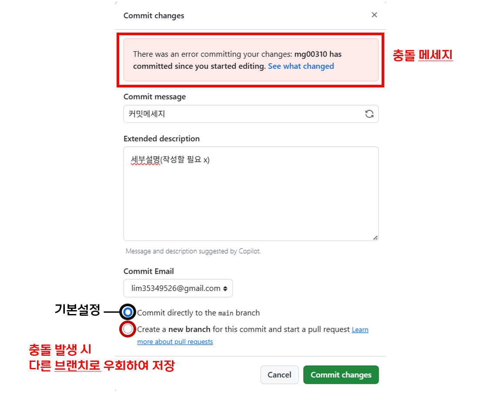

# OSS 11조 팀 프로젝트

**11/8일까지 주제를 톡방에서 정한 후 규칙을 정할 예정입니다.**

- **과제 제출 마감**: ~11/16(일)
- **제출물**: `RULES.md` 파일에 작성된 규칙 내용
- **평가 기준**: 팀 점수 (항목별 내용) + 개인 점수 (글자 수, 커밋 수, 참여 기간)

---

## 협업 규칙 (필독!)

과제 평가 항목인 **개별 커밋 수**를 공정하게 기록하고, 모든 팀원이 깃허브 웹사이트 환경에서 안전하게 협업하기 위해 다음 규칙을 준수합니다.

### 1. 기본 작업 방식: 웹에서 직접 수정

별도의 프로그램(Git CLI, Github Desktop 등)을 사용할 필요는 없습니다.
모든 작업은 **깃허브 웹사이트**에서 이루어집니다.

1.  수정할 파일(`RULES.md`)로 이동합니다.
2.  오른쪽 상단의 **연필 모양(Edit this file) 아이콘**을 클릭합니다.
3.  내용을 수정합니다.
4.  페이지 하단의 **'Commit changes'** 녹색 버튼을 눌러 작업을 저장합니다.
   

이후에 개정 단계에선 조항을 수정한 뒤, **반드시 파일 하단의 `5. 개정 내역 정리표`에 본인의 수정 사항을 한 줄 추가**합니다.

---

### 2. 충돌 발생 시 대처 방법

작업을 저장(Commit)하려 할 때, 다른 팀원이 방금 나와 같은 부분을 수정했다면 충돌(Conflict)이 발생합니다.

이때는 `main` 브랜치로 바로 저장이 불가능하며, 아래와 같은 화면이 나타납니다.

1.  커밋 창 상단에 There was an error committing your changes:...라는 경고문구가 생깁니다.
2.  Commit directly to the main branch 말고 **`Create a new branch for this commit and start a pull request.`** 옵션을 선택합니다.
3.  아래쪽 **'Propose changes'** 녹색 버튼을 클릭합니다.
4.  (자동으로 'Pull Request' 페이지가 열립니다.) 그냥 **'Create pull request'** 버튼을 한 번 더 누릅니다.
5.  그 다음에 알려주시면 제가 해결하겠습니다.
   

---

### 3. 커밋 메시지 규칙 (권장)

커밋 메세지를 그대로 두시면 안되고 어떤 걸 진행했는지 기록을 해야합니다.

ex:) 1조 오탈자 수정 

'Commit changes' 시, 메시지 첫머리에 '태그'를 달아주세요.

* `Add:`: 새로운 조항이나 내용을 추가했을 때
* `Fix:`: 오탈자 수정, 기존 내용 보완 시
* `Docs:`: `README.md` 수정 등 문서 작업 시

**좋은 예시:**
* `Add: 제3조 소음 관리 조항 신설 및 개정표 반영`
* `Fix: 1조 오탈자 수정 및 벌칙 문구 구체화`

---

## 👥 팀원 및 역할

| 이름 | Github ID | 담당 파트 |
| :--- | :--- | :--- |
| 임민규 | @mg00310 | 미정 |
| 김재욱 | @jwkuni333 | 미정 |
| 이서연 | @x | 미정 |
| 이예원 | @bumitaso | 미정 |
| 조혁준 | @hyuckjuncho | 미정 |